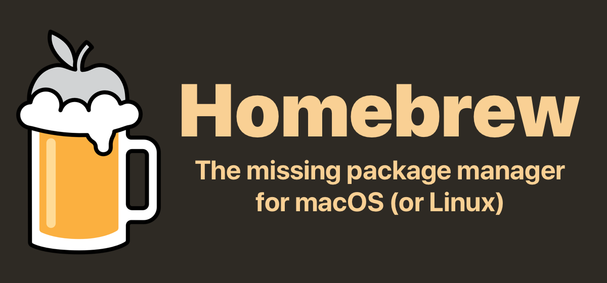

# The macOS dev setup (automated install of powerlevel10k and oh-my-zsh)

###### The quickest way to freshly replicate configuration across macOS (even in parallel) with brew.



# Automatically install zsh with powerlevel10k and oh-my-zsh

### Do you want to automatically do a package installation on your newly instaled macOS dev machines.


#### People would tell to do time machine backup and restore from them, but

## what if you like to do fresh install or may be debug a scenario or may be like to restore multiple machines in parallel.

### This shell script allows you to quickly install and configure freshly installed macos with all the dev needed onetime configuration.

## Please note that default packages are installed from following location

```
packages/commandlineTools.txt
packages/commandlineCaskTools.txt
```

## In case, you would want to tweak and add more packages, please feel free to add/edit those files, default assumption is to use single package name per line.

## just run

```
git clone https://github.com/nar3nd3r/lazy-dev-setup
cd lazy-dev-setup && chmod +x i_am_lazy.sh && ./i_am_lazy.sh
```

# Options Included:

- [x] Sets system hostname systemwide
- [x] Installs home brew
- [x] Install basic dev packages (can be tweaked to user's needs)
- [x] Tweak system configuration For easier management
- [x] Installs Themes For Vim
- [x] Installs Powerlevel10k for nice terminal looks
- [x] Install MesloLGS font
- [x] Installs ZSH and [oh-my-zsh](https://ohmyz.sh/)

Feel free to raise any bug or issue.


# if this script helped you a bit, please [donate a meal](https://www.paypal.me/nar3nd3rs1ngh).

###### Credits to [brew](https://brew.sh), I just used their tool make this scripts possible.
